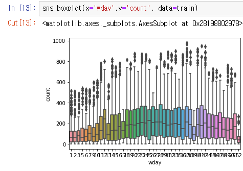
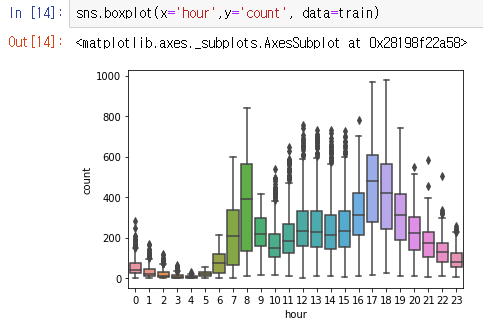
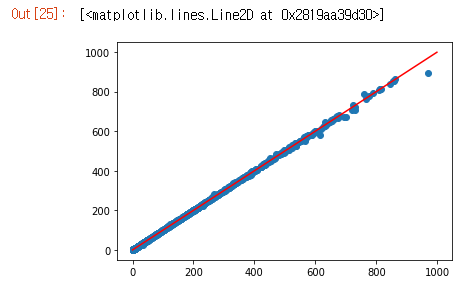
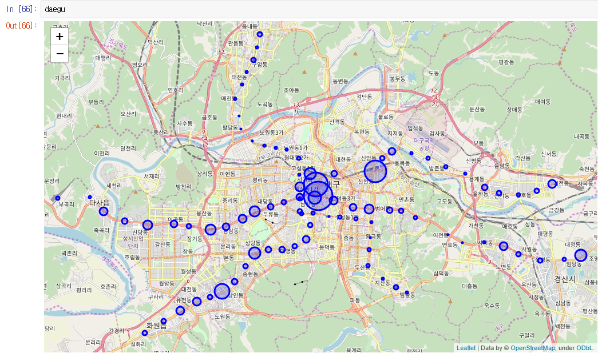

### KaggleBike
2011~2012년 이용 정보 분석

- 2011~2012년 주별 이용 수  
    
  
- 2011~2012년 시간별 이용 수  
    
  
- Random Forest 분석 ( MSE : 13.331243521469233 )  
  
  
----

### DaeguMetro
2017~2019년 역별 승하차 인원 분석  

- 2017년 역별 일평균 승하차 인원 시각화
  
