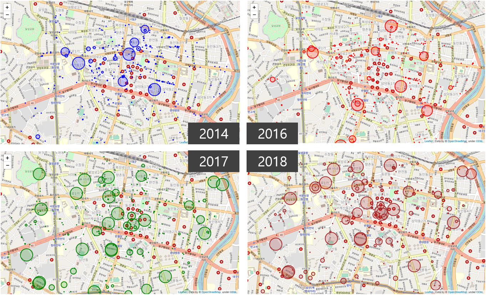
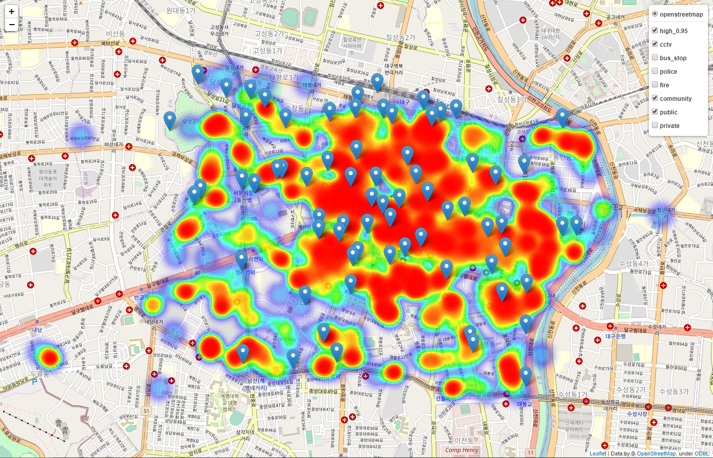

# 프로젝트 - 불법 주정차 적발 사례 분석 
[2014년 ~ 2019년 대구 중구 불법 주정차 사례 분석 및 해결방안 제시]  
대구 소재 공영주차장의 위치와 비교 분석.    

### coordinate.py  
지번주소 및 도로명주소 또는 특정장소를 Google Map API를 활용하여 위도, 경도를 추출하여 csv파일 형태로 저장
- \_GOOGLE MAP API KEY_ : 발급 받은 API key 입력
- \_FILENAME_.csv : 읽을 파일 명 입력 
- \_LOCATION_ : 읽은 파일에서 좌표를 구할 위치 및 장소 column의 headr 명을 입력  

### 연별 적발수.py 
위도, 경도가 저장된 CSV파일을 읽어 merge 실행 및 연도별 적발수 추출  

### 연별 적발수 시각화.py
matplotlib을 사용하여 해당 연도에 일어난 장소별로 적발 수 확인  
folium으로 연도별 적발 수를 지도 상에 시각화   

----

### dbscan.py
DBSCAN 클러스터링 알고리즘으로 불법주정차 적발 좌표값 분류 및 시각화

### main.py
2014.01.01 ~ 2019.06.30 단속 건수 : 403,075건
불법주정차 상위 5% 구역 단속 건수 : 302,036건

- 상위 5%, 년도별, 월별, 요일별, 시간별 히트맵으로 시각화
- CCTV, 경찰서, 소방서, 관공서, 민영주차장, 공영주차장 마커 표시  

